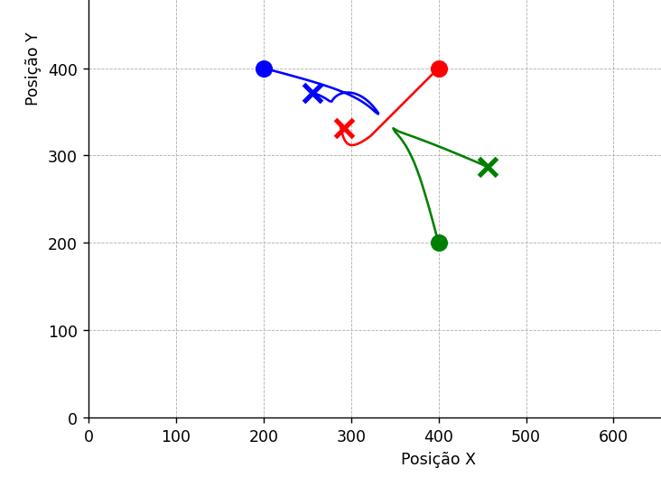
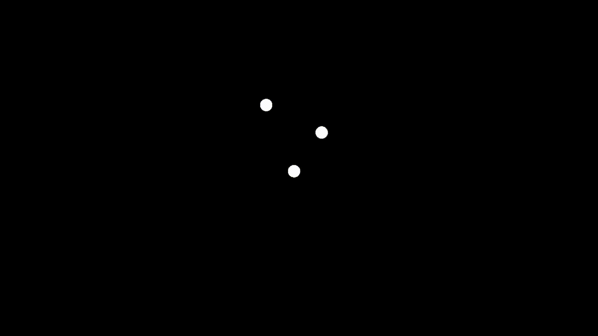

# Simulação de Atração Gravitacional 2D

Este projeto é uma simulação em C++ que demonstra a atração gravitacional e as colisões elásticas entre múltiplos corpos (bolas) em um ambiente 2D. A simulação utiliza a biblioteca Raylib para a renderização gráfica e a biblioteca Raymath para os cálculos vetoriais.

## Visão Geral

O objetivo principal é visualizar a Lei da Gravitação Universal de Newton em ação. Cada bola na simulação tem massa, posição e velocidade. As bolas se atraem com uma força proporcional ao produto de suas massas e inversamente proporcional ao quadrado da distância entre elas.

Além da gravidade, o projeto também implementa:
-   **Detecção de Colisão:** Detecta quando duas bolas se sobrepõem.
-   **Resolução de Colisão:** Calcula e aplica as novas velocidades para as bolas após uma colisão elástica, conservando o momento e a energia cinética.
-   **Interação com as Bordas:** As bolas ricocheteiam nas bordas da tela.

## Gráfico de Posição vs. Tempo

O gráfico abaixo ilustra a trajetória (posição) de cada bola ao longo do tempo. É possível observar as interações complexas que surgem a partir das simples regras da física implementadas.

## Física da Simulação

### Lei da Gravitação Universal de Newton

A força da gravidade ($F_g$) entre duas bolas é calculada usando a seguinte fórmula:

$$
F_g = G \frac{m_1 m_2}{r^2}
$$

Onde:
-   `G` é a constante gravitacional (ajustada para a escala da simulação).
-   `m1` e `m2` são as massas das duas bolas.
-   `r` é a distância entre os centros das bolas.

Para evitar forças excessivamente grandes quando as bolas estão muito próximas, uma "fator de suavização" (*softening factor*) é adicionado ao denominador.

### Colisões Elásticas

Quando duas bolas colidem, suas velocidades são recalculadas para simular uma colisão perfeitamente elástica. A resolução da colisão decompõe os vetores de velocidade de cada bola em componentes normal e tangente à linha de colisão. As componentes tangentes permanecem inalteradas, enquanto as componentes normais são trocadas de acordo com as leis de conservação de momento e energia.

## Estrutura do Código

O projeto é dividido em três classes principais:

-   `Ball`: Representa uma única bola. Contém suas propriedades físicas (raio, massa, posição, velocidade) e lida com sua própria lógica de movimento (integração de Euler) e interação com as bordas da tela.
-   `Engine`: Gerencia o estado geral da simulação. Contém um vetor de todas as bolas e, em seu loop de atualização, calcula as forças gravitacionais, detecta e resolve colisões entre todas as bolas.
-   `main`: O ponto de entrada do programa. Inicializa a janela do Raylib, cria as instâncias iniciais das bolas e da `Engine`, e executa o loop principal de atualização e renderização.

## Tecnologias Utilizadas

-   **C++:** Linguagem de programação principal.
-   **Raylib:** Uma biblioteca simples e fácil de usar para criação de videogames e aplicações gráficas.
